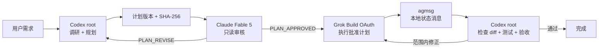

# Subscription Triad

让 **Codex 负责调研和规划，Claude Fable 5 负责独立审核，Grok Build 负责执行，最后由 Codex 验收**。所有模型都走各自官方 CLI 的订阅登录，不需要 API Key。

> Status: early preview (`0.1.0`). The approval gate and local state machine are implemented and tested; provider availability still depends on the installed official CLIs and current subscription terms.



## 为什么做这个项目

[Codex-Orchestration](https://github.com/Cjbuilds/Codex-Orchestration) 已经证明了“Planner / Advisor / Executor + 最终由 Codex 收口”的门禁模式；[agmsg](https://github.com/fujibee/agmsg) 提供了跨 CLI agent 的本地持久消息层。Subscription Triad 将两者的关键优势收束到用户的特定工作流中：

- Codex 当前任务始终是根协调者，不把最终决策交给其他模型。
- Fable 只能审核计划：无工具、无编辑、无会话持久化。
- 审批绑定计划 SHA-256；计划一改，原审批自动失效。
- Grok 只在明确批准后启动，并复用同一个 feature session 处理范围内修正。
- agmsg 只通过公开的 `join.sh`、`send.sh`、`api.sh` 接口使用，不依赖其 SQLite 内部结构。
- Grok 完成不等于项目完成；Codex 必须独立检查代码和测试。

## 订阅制安全边界

| 模型 | 实际调用 | 认证约束 |
|---|---|---|
| Codex | 当前 Codex 任务 | 使用用户已有的 ChatGPT/Codex 登录 |
| Fable | 官方 `claude -p --model claude-fable-5` | 必须报告 Claude.ai first-party Pro/Max |
| Grok | 官方 `grok --oauth --model grok-build` | 强制 OAuth 路径，不构造 xAI API 请求 |

每个 Claude/Grok 子进程都会移除 `ANTHROPIC_API_KEY`、`XAI_API_KEY` 和相关自定义端点/云平台变量。Grok 子进程还强制设置 `GROK_DISABLE_API_KEY_AUTH=1`，并通过 `grok inspect --json` 验证 CLI 已禁用 API-key 认证。项目不会读取、保存或转发 OAuth Token。

Grok Build CLI 目前没有提供与 `claude auth status` 同等强度的机器可读“订阅类型”证明，因此这里采用可验证的最小边界：禁用 API-key 认证、强制官方 CLI 的 `--oauth`、清除端点覆盖、检查 `grok-build` 可用，并且从不调用 `api.x.ai`。这不是对厂商条款永不变化的保证。

## 前置条件

- Codex CLI/Desktop，以及有效的 ChatGPT/Codex 订阅登录。
- 官方 Claude Code CLI，以及 Claude Pro/Max 登录。
- 官方 Grok Build CLI，以及 SuperGrok/X Premium Plus 对应的 OAuth 登录。
- Python 3.9+、Bash、SQLite。
- [agmsg](https://github.com/fujibee/agmsg)；最快安装方式：

```bash
npx agmsg
```

认证：

```bash
claude auth login
grok login --oauth
```

不要设置 Anthropic 或 xAI API Key。

## 安装 Codex 插件

克隆仓库后，在仓库根目录执行：

```bash
git clone https://github.com/Mnufs/subscription-triad.git
cd subscription-triad
codex plugin marketplace add "$(pwd)"
codex plugin add subscription-triad@subscription-triad
```

然后新建一个 Codex 任务，让新 Skill 和 MCP 工具进入上下文。

## 使用

在目标项目的 Codex 任务中说：

```text
Use $subscription-triad to implement this feature:
<你的功能需求>
```

典型运行阶段：

1. `doctor`：只检查 CLI、认证和 agmsg，不调用模型。
2. `create_run`：把需求、验收条件和真实仓库事实写入本地运行目录。
3. `record_plan`：Codex 保存计划版本及 SHA-256。
4. `review_plan`：Fable 返回 `PLAN_APPROVED` 或 `PLAN_REVISE`，最多五轮。
5. `dispatch_grok`：后台启动 Grok Build 执行批准计划。
6. `run_status`：读取状态、产物和 agmsg 消息。
7. `continue_grok`：仅对批准范围内的问题复用原 Grok session 修正。
8. `record_verification`：Codex 记录独立验收；只有 `pass` 才完成。

运行产物默认保存在：

```text
<project>/.subscription-triad/runs/<uuid>/
```

其中可能包含需求、仓库上下文、计划、Fable 审核、Grok 输出和验收报告。建议目标项目将 `.subscription-triad/` 加入 `.gitignore`。

## 手动 CLI

插件内同时提供纯标准库 CLI，便于调试：

```bash
TRIAD="plugins/subscription-triad/skills/subscription-triad/scripts/triad_cli.py"

python3 "$TRIAD" doctor --project /path/to/project
python3 "$TRIAD" create \
  --project /path/to/project \
  --task-file task.md \
  --acceptance-file acceptance.md \
  --context-file context.md
```

其他子命令可通过 `python3 "$TRIAD" --help` 查看。

## 缓存策略与取舍

“缓存命中”通常依赖供应商对稳定提示词前缀的匹配，订阅产品不一定公开命中率或精确 Token。项目只优化可控制的部分：

- Codex 在同一根任务里完成调研、规划和验收。
- Fable 使用稳定 system prompt，但每轮保持无状态，优先保证审核独立性。
- 每个功能只创建一个 Grok session；验证修正通过 `--resume` 继续。
- 大上下文落本地 artifact，agmsg 只传短状态和路径，避免重复发送完整对话。
- Grok 禁用跨 session memory，防止不同项目互相污染；同一 session 内的上下文仍保留。

因此这个项目明确选择：**Fable 的独立审核优先于会话复用；Grok 的连续执行优先复用同一会话。**

## 本地开发

```bash
python3 -m unittest discover -s tests -v
python3 "${CODEX_HOME:-$HOME/.codex}/skills/.system/skill-creator/scripts/quick_validate.py" \
  plugins/subscription-triad/skills/subscription-triad
```

第二条命令中的 validator 路径只适用于本机 Codex 开发环境；CI 会执行仓库自带的结构和行为测试。

## 上游与许可证

本项目基于 MIT 许可下的架构思想和部分安全调用模式构建：

- [Cjbuilds/Codex-Orchestration](https://github.com/Cjbuilds/Codex-Orchestration)
- [fujibee/agmsg](https://github.com/fujibee/agmsg)

详细归属见 [THIRD_PARTY_NOTICES.md](THIRD_PARTY_NOTICES.md)。Subscription Triad 本身采用 MIT License。

## English summary

Subscription Triad is a Codex plugin for a fail-closed, subscription-only workflow: Codex plans, Claude Fable 5 reviews the exact plan, Grok Build executes after approval, agmsg carries local lifecycle messages, and Codex independently verifies the result. No API key is required or accepted by provider subprocesses.
