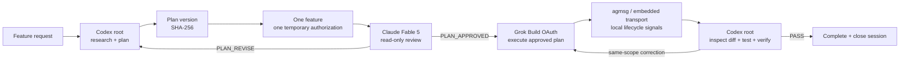

# Model Combo

[English](README.md) | [简体中文](README.zh-CN.md)

Subscription-native orchestration for AI coding CLIs.

> Turn your AI subscriptions into one coding team.

[](LICENSE)

[](https://github.com/Mnufs/model-combo/actions/workflows/tests.yml)

*Formerly `subscription-triad`.*

Model Combo coordinates the official AI coding CLIs you already subscribe to. Codex plans, Claude reviews the exact plan, Grok executes, and Codex independently verifies — one gated pipeline, not a voting ensemble. It never proxies, resells, or converts your subscriptions into API access.



*One plan, one approval, one unbroken chain — change the plan and the combo drops.*

> **Preview status:** the plan-hash gate, one-authorization feature session, provider sanitization, local state machine, and test suite are implemented. Provider availability and subscription treatment still depend on the installed official CLIs and current vendor terms.

## Why

A coding model can plan, implement, and review its own work, but that keeps every decision inside one context. Calling several models independently does not fix that by itself: without a fixed handoff and explicit gates, they can disagree, drift in scope, or execute an unreviewed plan. Repeating the same large prompt also wastes context, while API fallbacks can create billing paths the user did not intend.

Model Combo makes the responsibilities explicit:

- **Codex is the root.** It researches the real repository, owns the canonical plan, reconciles review findings, and performs final verification.
- **Claude Fable 5 is the reviewer.** It receives a self-contained packet with no tools, no edits, no permission prompts, and no persistent review session.
- **Grok Build is the executor.** It starts only after Fable approves the current plan hash and resumes the same feature session only for bounded corrections.
- **The state machine is fail-closed.** Missing authentication, malformed output, a changed plan, a lost session, or an exhausted review limit stops execution.
- **Large context stays local without touching the worktree.** Artifacts live in a private user-state directory outside the target project; agmsg or the embedded SQLite transport carries short lifecycle signals and paths.

### Where it fits

| Tool | Primary job | Coordination shape | Best fit |
|---|---|---|---|
| **Model Combo** | Codex plugin for subscription-authenticated coding CLIs | Sequential, hash-gated plan → review → execution → verification | One feature that needs independent review before another model edits |
| [CrewAI](https://github.com/crewAIInc/crewAI) | General Python framework for autonomous agents and flows | User-defined crews, tasks, and event flows | Building custom multi-agent applications |
| [claude-squad](https://github.com/smtg-ai/claude-squad) | Terminal session manager for coding agents | Multiple isolated worktrees and terminal sessions, often in parallel | Running and supervising several tasks at once |
| **Codex alone** | General coding agent | One task context plans, implements, and verifies | Work that does not need a separate provider review gate |

The architecture was informed by [Cjbuilds/Codex-Orchestration](https://github.com/Cjbuilds/Codex-Orchestration), while [fujibee/agmsg](https://github.com/fujibee/agmsg) inspired the local lifecycle handoff. See [Third-party notices](THIRD_PARTY_NOTICES.md) for attribution.

## How a run works

| Stage | Owner | What happens | Gate |
|---:|---|---|:---:|
| 1 | Codex | Inspect the repository and create a run from the task, acceptance criteria, and verified context. |  |
| 2 | Codex | Record the canonical plan and its SHA-256 digest. | ✓ |
| 3 | Host session | Start one run-bound provider process and run `doctor` without calling a model. | ✓ |
| 4 | Fable | Return exactly `PLAN_APPROVED` or `PLAN_REVISE` for that plan digest. | ✓ |
| 5 | Codex | Resolve every material finding and record a new plan when required. `PLAN_REVISE` is the combo breaker. | ✓ |
| 6 | Grok | Execute only when the approved digest still equals the current plan digest. | ✓ |
| 7 | Codex | Inspect the worktree, run tests, and either pass or request a bounded same-scope continuation. | ✓ |
| 8 | Codex | Record verification, close the provider session, and report evidence. | ✓ |

Changing the plan after approval invalidates that approval. Changing scope after execution starts requires a new run; a continuation cannot smuggle in new architecture, contracts, or acceptance criteria.

<details>
<summary>Representative sanitized end-to-end transcript</summary>

This representative record shows the observable protocol; it is not a raw provider recording. Paths, UUIDs, and hashes are shortened, and private repository context is intentionally not committed.

```text
USER          Implement the feature and keep the existing public contract.
CODEX         run created: <state-root>/projects/8d41…/runs/7b3c…/
CODEX         plan v1 recorded: sha256=9f2a6c1e…
HOST          provider session ready; scope=single_feature_session
DOCTOR        claude=ready (firstParty/Pro), grok=ready (OAuth), api_env=[]
FABLE         PLAN_REVISE — F-001: add the missing rollback check
CODEX         plan v2 recorded: sha256=4d18b771…
FABLE         PLAN_APPROVED — approved_sha256=4d18b771…
GROK          execution round 1 finished; artifact=executor-response.json
CODEX         verification: tests passed, diff matches approved plan
CODEX         run=complete; verification=pass; provider session closed
```

</details>

## Security boundaries

### Provider routes

| Role | Actual call | Authentication constraint | Rejected path |
|---|---|---|---|
| Codex root | Current Codex task | Existing ChatGPT/Codex login | A custom OpenAI API provider created by this plugin |
| Fable reviewer | Official `claude -p --model claude-fable-5` | `claude.ai`, `firstParty`, Pro or Max | Anthropic API keys, Bedrock, Vertex, Foundry, extracted tokens, credential proxies |
| Grok executor | Official `grok --oauth` with an advertised Grok Build model | OAuth forced and API-key auth disabled | `XAI_API_KEY`, `api.x.ai`, OpenRouter, custom endpoint overrides |
| Handoff | agmsg public scripts or the embedded local SQLite store | Local files only | Reading or mutating agmsg private internals |

Claude and Grok subprocesses receive a sanitized environment. Model Combo removes the relevant API credentials and endpoint/provider overrides, forces `GROK_DISABLE_API_KEY_AUTH=1`, verifies Grok's login policy through `grok inspect --json`, fixes `--cwd` to the target repository, and enables Grok's `workspace` sandbox. It never reads, stores, prints, or forwards OAuth tokens.

Grok Build does not currently expose a machine-readable subscription-plan identity as strong as `claude auth status`. Model Combo therefore enforces the boundary it can verify: no API-key authentication, official OAuth CLI execution, no endpoint overrides, and a fresh advertised model check. This is not a promise that vendor terms, limits, billing treatment, CLI behavior, or enforcement will never change.

### Guarantees and non-goals

| Guarantees | Non-goals |
|---|---|
| Provider API credentials and endpoint overrides are stripped before Claude/Grok calls. | Model Combo is not a credential proxy, subscription reseller, or API gateway. |
| Every Fable approval is bound to the exact canonical plan SHA-256. | It is not a voting ensemble or model router. |
| Provider failures, stale hashes, lost sessions, and malformed replies fail closed. | It does not choose a “winning” model answer. |
| The plugin does not change project/global Codex network settings or create persistent approval rules. | It does not grant network access or replace the user's host permission policy. |
| Tokens are never requested or persisted; run artifacts stay in private user state outside the target worktree. | It does not buy, bundle, extend, or guarantee any vendor subscription. |
| Codex must verify the actual diff and tests before a run can pass. | Provider success is not treated as proof that the feature is correct. |

### One feature, one authorization

The MCP server performs local state operations. After the plan is recorded, it returns one exact argument vector for `combo_provider.py session --run <run_dir>`. The host may ask the user to authorize that temporary process once. Later `doctor`, `review`, `dispatch`, `continue`, and `close` actions travel as bounded JSON lines over the same process stdin.

The process is locked to one run ID and one target repository. It accepts no arbitrary shell command, holds an exclusive private lease, expires after 30 minutes idle or four hours total, and is closed immediately after final verification. A new feature, expired/closed session, Codex restart, or lost process handle needs a new authorization. Model Combo never changes the user's “Ask for approval” or automatic-approval preference.

### Local data

Run artifacts and the embedded lifecycle database live outside target worktrees:

| Platform | Default state root |
|---|---|
| macOS | `~/Library/Application Support/Model Combo/` |
| Linux/Unix | `${XDG_STATE_HOME:-~/.local/state}/model-combo/` |
| Windows | `%LOCALAPPDATA%\Model Combo\` |

Each project is isolated as `projects/<project-hash>/`. Runs live in `runs/<uuid>/`, and the embedded transport uses `transport/messages.sqlite3`. No target-project configuration or `.gitignore` change is needed.

Set `MODEL_COMBO_STATE_DIR` to an absolute path to override the root. Changing it makes existing runs unavailable until the original value is restored. State directories use mode `0700` where POSIX permissions are available. Artifacts can contain the task, absolute project path, repository context, plans, reviews, executor output, logs, and verification reports; review them before sharing.

For the complete threat, billing, caller, failure, and cache boundaries, read [security-and-cache.md](plugins/model-combo/skills/model-combo/references/security-and-cache.md) and [SECURITY.md](SECURITY.md).

### FAQ

**Can using Claude through MCP get my Anthropic account banned?**

Model Combo does not embed Claude behind an unofficial API, extract tokens, or bypass the official CLI. It launches the installed `claude` command under its normal first-party login and disables tools for review. That reduces avoidable risk, but only Anthropic controls its terms and enforcement, so no open-source plugin can promise that an account will never be restricted.

**Can Grok still be billed like API usage?**

The plugin rejects API-key authentication and custom xAI endpoints and calls the official Grok Build CLI with `--oauth`. The CLI does not provide a strong machine-readable guarantee about how xAI will account for every OAuth request, so the plugin reports the verifiable route instead of claiming a billing guarantee. Users remain responsible for current xAI terms and account usage.

**Will I approve every model call?**

Normally no. One uninterrupted feature run uses one temporary host authorization for readiness checks, Fable reviews, Grok execution, and bounded continuations. A new run or a lost/expired session requires another authorization.

## Quickstart

### Prerequisites

- [ ] Codex CLI/Desktop with an active ChatGPT/Codex login
- [ ] Official Claude Code CLI with Claude Pro or Max
- [ ] Official Grok Build CLI with OAuth access
- [ ] Python 3.9 or newer

Authenticate with the vendor CLIs:

```bash
claude auth login
grok login --oauth
```

Do not configure Anthropic or xAI API keys for this workflow. agmsg is optional: when it is installed, Model Combo uses only its public scripts; otherwise the embedded dependency-free local transport is selected automatically.

If `grok --oauth models` says you are logged in but also reports `Settings fetch failed after ...`, OAuth exists but online readiness is not confirmed. Any displayed default model may be cached fallback output, so Model Combo stops before model calls until the CLI can refresh successfully.

### Install from GitHub

```bash
codex plugin marketplace add Mnufs/model-combo
codex plugin add model-combo@model-combo
```

Start a new Codex task so the new Skill and MCP server enter the task context. Then run the non-executing readiness check:

```text
Use $model-combo to check provider readiness only. Do not call Fable or Grok, and do not modify source files.
```

### Local development install

```bash
git clone https://github.com/Mnufs/model-combo.git
cd model-combo
codex plugin marketplace add "$(pwd)"
codex plugin add model-combo@model-combo
```

### Migrating from 0.4.x

Version 0.5.0 moves all new run artifacts and embedded transport data out of target worktrees. Existing `<project>/.model-combo/` runs are not scanned or moved automatically; finish them with 0.4.x or move them deliberately before resuming. New runs need no project `.gitignore` entry.

### Migrating from `subscription-triad`

Version 0.4.0 renames the marketplace, plugin, Skill, scripts, and run directory. Finish or close active 0.3.x runs before upgrading; `.subscription-triad/` data is left untouched and is not resumed automatically.

```bash
codex plugin remove subscription-triad@subscription-triad
codex plugin marketplace remove subscription-triad
codex plugin marketplace add Mnufs/model-combo
codex plugin add model-combo@model-combo
```

Open a new Codex task after migration.

## Usage

In a Codex task opened on the target repository:

```text
Use $model-combo to implement this feature:

<requirements>

Acceptance criteria:
- <observable result>
- <tests or compatibility boundary>
```

The root should report the run state, approved plan version/hash prefix, authorization count, Fable decision/review count, Grok execution rounds, verification commands, and remaining risks.

## Manual CLI

The plugin includes a dependency-free CLI for development and state-machine debugging:

```bash
COMBO="plugins/model-combo/skills/model-combo/scripts/combo_cli.py"

python3 "$COMBO" doctor --project /path/to/project
python3 "$COMBO" create --project /path/to/project --task-file task.md --acceptance-file acceptance.md --context-file context.md
python3 "$COMBO" --help
```

`combo_provider.py` is the restricted host bridge used by Codex. Its command line exposes only `session --run <run_dir>`, and its live protocol accepts only `doctor`, `review`, `dispatch`, `continue`, and `close`. It is not a general command runner.

## Design trade-offs

### Cache and context reuse

Provider prompt caches usually depend on a stable prefix; subscription products may not expose cache-hit metrics or exact token accounting. Model Combo optimizes only what it controls:

- Codex plans and verifies in one root task.
- Fable receives a stable system prefix plus the canonical packet, but each review is fresh and stateless.
- One Grok session is created per feature and resumed for bounded corrections.
- Large handoffs stay in local artifacts; transport messages carry short statuses and paths.
- Grok cross-session memory is disabled to avoid unrelated-project contamination.

The deliberate trade-off is: **Fable review independence over conversation reuse; Grok execution continuity over a fresh correction session.** Cache reuse never overrides stale-plan protection or scope control.

### Fail closed over silent fallback

Model Combo does not replace a missing subscription login with an API key, a custom provider, a background daemon, or a weaker unreviewed route. If the host cannot retain a writable process session, the feature stops rather than changing persistent network permissions or asking for a broad command rule.

## Development

```bash
python3 -m unittest discover -s tests -v
python3 -m compileall -q plugins tests
python3 "$HOME/.codex/skills/.system/plugin-creator/scripts/validate_plugin.py" +  plugins/model-combo
python3 "$HOME/.codex/skills/.system/skill-creator/scripts/quick_validate.py" +  plugins/model-combo/skills/model-combo
```

See [CONTRIBUTING.md](CONTRIBUTING.md) for invariants contributors must preserve.

## Credits and license

Model Combo is an independent project and is not affiliated with or endorsed by OpenAI, Anthropic, xAI, Cjbuilds, or fujibee.

- [Cjbuilds/Codex-Orchestration](https://github.com/Cjbuilds/Codex-Orchestration)
- [fujibee/agmsg](https://github.com/fujibee/agmsg)

See [THIRD_PARTY_NOTICES.md](THIRD_PARTY_NOTICES.md) for attribution. Model Combo is released under the [MIT License](LICENSE).
