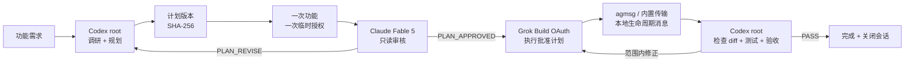

# Model Combo

[English](README.md) | 简体中文

面向 AI 编码 CLI 的订阅原生编排。

> 把你的 AI 订阅组成一支编码团队。

[](LICENSE)

[](https://github.com/Mnufs/model-combo/actions/workflows/tests.yml)

*原名 `subscription-triad`。*

Model Combo 协调你已经订阅的官方 AI 编码 CLI。Codex 规划，Claude 审核完全相同的计划，Grok 执行，最后由 Codex 独立验收——这是一条带门禁的顺序流水线，不是多模型投票集成。它不代理、不转售，也不会把你的订阅转换成 API 访问。



*一个计划、一次批准、一条不断的连招——计划一变，Combo 就断。*

> **预览状态：**计划哈希门禁、一次授权的功能会话、provider 环境净化、本地状态机和测试套件已经实现。provider 是否可用、订阅如何计算，仍取决于本机安装的官方 CLI 和厂商当前条款。

## 为什么做

一个编码模型可以同时规划、实现和自审，但所有判断仍留在同一份上下文中。单纯多叫几个模型也不会自动解决问题：如果没有固定交接物和明确门禁，模型可能互相冲突、范围漂移，甚至执行未经审核的计划。反复发送同一份大上下文会浪费上下文，而 API 兜底还可能引入用户没有打算承担的计费路径。

Model Combo 把职责固定下来：

- **Codex 是根协调者。**它调研真实仓库，持有唯一的标准计划，消化审核意见，并负责最终验收。
- **Claude Fable 5 是审核者。**它收到自包含审核包，但没有工具、编辑权限、授权提示或持久审核会话。
- **Grok Build 是执行者。**只有 Fable 批准当前计划哈希后才会启动；只有批准范围内的修正才会复用同一个功能会话。
- **状态机默认关闭。**认证缺失、输出格式错误、计划变化、会话丢失或审核次数耗尽，都会阻止执行。
- **大上下文留在本地。**产物放在目标项目中；agmsg 或内置 SQLite 传输只交换短状态和文件路径。

### 它处在什么位置

| 工具 | 主要用途 | 协作形态 | 更适合 |
|---|---|---|---|
| **Model Combo** | 面向订阅认证编码 CLI 的 Codex 插件 | 顺序执行、计划哈希门禁：规划 → 审核 → 执行 → 验收 | 一个功能在其他模型动代码前需要独立审核 |
| [CrewAI](https://github.com/crewAIInc/crewAI) | 通用 Python 自主 Agent / Flow 框架 | 用户自定义 Crew、任务和事件流 | 构建自定义多智能体应用 |
| [claude-squad](https://github.com/smtg-ai/claude-squad) | 编码 Agent 终端会话管理器 | 多个隔离 worktree 和终端会话，通常并行 | 同时运行和监督多个任务 |
| **直接使用 Codex** | 通用编码 Agent | 一个任务上下文内规划、实现和验收 | 不需要独立厂商审核门禁的工作 |

架构参考了 [Cjbuilds/Codex-Orchestration](https://github.com/Cjbuilds/Codex-Orchestration)，本地生命周期交接受 [fujibee/agmsg](https://github.com/fujibee/agmsg) 启发。归属说明见 [THIRD_PARTY_NOTICES.md](THIRD_PARTY_NOTICES.md)。

## 一次运行如何工作

| 阶段 | 负责人 | 发生什么 | 门禁 |
|---:|---|---|:---:|
| 1 | Codex | 检查真实仓库，用需求、验收条件和已验证上下文创建 run。 |  |
| 2 | Codex | 记录唯一标准计划和 SHA-256。 | ✓ |
| 3 | 宿主会话 | 启动一个绑定 run 的 provider 进程，并在不调用模型的情况下执行 `doctor`。 | ✓ |
| 4 | Fable | 针对该计划哈希返回 `PLAN_APPROVED` 或 `PLAN_REVISE`。 | ✓ |
| 5 | Codex | 解决所有实质问题，必要时记录新计划。`PLAN_REVISE` 就是 combo breaker。 | ✓ |
| 6 | Grok | 只有批准哈希仍等于当前计划哈希时才执行。 | ✓ |
| 7 | Codex | 检查工作树、运行测试，通过或发起批准范围内的有限续跑。 | ✓ |
| 8 | Codex | 记录验收结论、关闭 provider 会话，并汇报证据。 | ✓ |

批准后修改计划会立即让批准失效。执行开始后如果范围发生变化，必须创建新 run；续跑不能夹带新的架构、数据契约或验收标准。

<details>
<summary>代表性的脱敏端到端运行记录</summary>

下面是对可观察协议的代表性记录，不是未经处理的 provider 原始录屏。路径、UUID 和哈希已缩短，私有仓库上下文不会提交到公开仓库。

```text
用户           实现这个功能，并保持现有公开契约不变。
CODEX          已创建 run：.model-combo/runs/7b3c…/
CODEX          已记录计划 v1：sha256=9f2a6c1e…
HOST           provider 会话已就绪；scope=single_feature_session
DOCTOR         claude=ready (firstParty/Pro), grok=ready (OAuth), api_env=[]
FABLE          PLAN_REVISE — F-001：补充缺失的回滚检查
CODEX          已记录计划 v2：sha256=4d18b771…
FABLE          PLAN_APPROVED — approved_sha256=4d18b771…
GROK           第 1 轮执行完成；artifact=executor-response.json
CODEX          验收：测试通过，diff 与批准计划一致
CODEX          run=complete；verification=pass；provider 会话已关闭
```

</details>

## 安全边界

### Provider 路由

| 角色 | 实际调用 | 认证约束 | 明确拒绝 |
|---|---|---|---|
| Codex root | 当前 Codex 任务 | 用户已有的 ChatGPT/Codex 登录 | 插件自行创建 OpenAI API provider |
| Fable 审核者 | 官方 `claude -p --model claude-fable-5` | `claude.ai`、`firstParty`、Pro 或 Max | Anthropic API Key、Bedrock、Vertex、Foundry、提取 Token、凭据代理 |
| Grok 执行者 | 官方 `grok --oauth` 和 CLI 公布的 Grok Build 模型 | 强制 OAuth，禁用 API-key 认证 | `XAI_API_KEY`、`api.x.ai`、OpenRouter、自定义端点 |
| 交接层 | agmsg 公开脚本或内置本地 SQLite | 仅本地文件 | 读取或修改 agmsg 私有内部数据 |

Claude/Grok 子进程接收净化后的环境。Model Combo 会移除相关 API 凭据和端点/provider 覆盖，强制 `GROK_DISABLE_API_KEY_AUTH=1`，通过 `grok inspect --json` 验证 Grok 登录策略，把 `--cwd` 固定为目标仓库，并启用 Grok 的 `workspace` 沙箱。它不会读取、保存、打印或转发 OAuth Token。

Grok Build 目前没有提供与 `claude auth status` 同等强度、可机器读取的订阅类型证明。因此 Model Combo 只承诺它能验证的边界：禁用 API-key 认证、使用官方 OAuth CLI、清除端点覆盖，并检查最新公布的可用模型。这不是对厂商条款、限额、计费方式、CLI 行为或执行策略永不变化的保证。

### Guarantees / Non-goals

| Guarantees（保证） | Non-goals（不负责） |
|---|---|
| 调用 Claude/Grok 前移除 provider API 凭据和端点覆盖。 | Model Combo 不是凭据代理、订阅转售商或 API 网关。 |
| 每次 Fable 批准都绑定唯一标准计划的精确 SHA-256。 | 它不是投票集成系统，也不是模型路由器。 |
| provider 失败、哈希过期、会话丢失和回复格式错误全部 fail closed。 | 它不会从多个模型答案中选“获胜者”。 |
| 插件不修改项目/全局 Codex 网络设置，也不创建持久授权规则。 | 它不授予网络权限，也不替换用户的宿主授权策略。 |
| 不索取或落盘 Token；run 产物保留在项目本地。 | 它不购买、打包、延长或保证任何厂商订阅。 |
| Codex 必须验证真实 diff 和测试后，run 才能通过。 | provider 成功不等于功能正确。 |

### 一次功能、一次授权

MCP server 只做本地状态操作。记录计划后，它返回一条精确参数向量：`combo_provider.py session --run <run_dir>`。宿主可能要求用户为这个临时进程授权一次；后续 `doctor`、`review`、`dispatch`、`continue` 和 `close` 通过同一个进程的 stdin 发送受限 JSON 行。

该进程被锁定到一个 run ID 和一个目标仓库，不接受任意 shell 命令；它持有独占私有租约，空闲 30 分钟或总计 4 小时后自动退出，最终验收后会立即主动关闭。新功能、过期/关闭的会话、Codex 重启或进程句柄丢失，都需要重新授权。Model Combo 不会修改用户的“Ask for approval”或自动授权偏好。

### 本地数据

运行产物保存在：

```text
<project>/.model-combo/runs/<uuid>/
```

其中可能包含需求、仓库上下文、计划、审核、执行输出、日志和验收报告。本仓库已经忽略该目录；用户也应在目标项目中忽略 `.model-combo/`，并在手动分享产物前完成检查。

完整的威胁、计费、调用方、失败和缓存边界见 [security-and-cache.md](plugins/model-combo/skills/model-combo/references/security-and-cache.md) 与 [SECURITY.md](SECURITY.md)。

### FAQ

**通过 MCP 使用 Claude 会导致 Anthropic 封号吗？**

Model Combo 不会把 Claude 包装成非官方 API，不提取 Token，也不绕过官方 CLI；它在正常第一方登录下启动本机 `claude`，并在审核时禁用工具。这能减少可避免风险，但条款和执行策略由 Anthropic 控制，任何开源插件都不能保证账号永远不会受限。

**Grok 仍可能按 API 使用量计费吗？**

插件拒绝 API-key 认证和自定义 xAI 端点，并通过 `--oauth` 调用官方 Grok Build CLI。但该 CLI 没有提供足够强的机器可读证明，无法保证 xAI 会如何计算每一次 OAuth 请求。因此插件只报告可验证的调用路径，不做计费保证；用户仍需遵守 xAI 当前条款并关注账号用量。

**每次模型调用都要授权吗？**

正常情况下不用。一次不中断的功能 run，只需要为临时宿主进程授权一次，覆盖就绪检查、Fable 审核、Grok 执行和批准范围内的续跑。新 run 或丢失/过期的会话需要再次授权。

## 快速开始

### 前置条件

- [ ] Codex CLI/Desktop，以及有效的 ChatGPT/Codex 登录
- [ ] 官方 Claude Code CLI，以及 Claude Pro 或 Max
- [ ] 官方 Grok Build CLI，以及 OAuth 访问
- [ ] Python 3.9+

先通过厂商 CLI 登录：

```bash
claude auth login
grok login --oauth
```

不要为这条工作流配置 Anthropic 或 xAI API Key。agmsg 不是前置条件：已安装时，Model Combo 只使用其公开脚本；未安装时自动选择零依赖的内置本地传输。

### 从 GitHub 安装

```bash
codex plugin marketplace add Mnufs/model-combo
codex plugin add model-combo@model-combo
```

新建一个 Codex 任务，让新 Skill 和 MCP server 进入任务上下文，然后先执行不调用模型的就绪检查：

```text
Use $model-combo to check provider readiness only. Do not call Fable or Grok, and do not modify source files.
```

### 本地开发安装

```bash
git clone https://github.com/Mnufs/model-combo.git
cd model-combo
codex plugin marketplace add "$(pwd)"
codex plugin add model-combo@model-combo
```

### 从 `subscription-triad` 迁移

0.4.0 会改名 marketplace、插件、Skill、脚本和 run 目录。升级前先完成或关闭仍在运行的 0.3.x run；`.subscription-triad/` 数据会原样保留，不会被自动迁移或续跑。

```bash
codex plugin remove subscription-triad@subscription-triad
codex plugin marketplace remove subscription-triad
codex plugin marketplace add Mnufs/model-combo
codex plugin add model-combo@model-combo
```

迁移后请新建一个 Codex 任务。

## 使用

在目标仓库的 Codex 任务中输入：

```text
Use $model-combo to implement this feature:

<功能需求>

Acceptance criteria:
- <可观察结果>
- <测试或兼容边界>
```

根协调者最终应汇报：run 状态、批准的计划版本/哈希前缀、授权次数、Fable 决策/审核轮次、Grok 执行轮次、验收命令和剩余风险。

## 手动 CLI

插件提供零第三方依赖的 CLI，方便开发和状态机调试：

```bash
COMBO="plugins/model-combo/skills/model-combo/scripts/combo_cli.py"

python3 "$COMBO" doctor --project /path/to/project
python3 "$COMBO" create +  --project /path/to/project +  --task-file task.md +  --acceptance-file acceptance.md +  --context-file context.md
python3 "$COMBO" --help
```

`combo_provider.py` 是 Codex 使用的受限宿主桥。命令行只开放 `session --run <run_dir>`，会话协议只接受 `doctor`、`review`、`dispatch`、`continue` 和 `close`；它不是通用命令执行器。

## 设计取舍

### 缓存与上下文复用

provider 提示缓存通常依赖稳定前缀；订阅产品未必公开缓存命中率或准确 Token 统计。Model Combo 只优化自己可控制的部分：

- Codex 在同一个根任务里规划和验收。
- Fable 收到稳定 system 前缀和唯一标准审核包，但每轮审核保持全新、无状态。
- 每个功能只创建一个 Grok session，批准范围内的修正通过 resume 复用。
- 大交接物保存在本地产物中，传输层只发送短状态和路径。
- 禁用 Grok 跨 session memory，避免不同项目上下文污染。

项目明确选择：**Fable 的审核独立性优先于对话复用；Grok 的执行连续性优先于为修正创建新会话。**缓存复用永远不能越过过期计划保护或范围控制。

### Fail closed 优先于静默兜底

Model Combo 不会在订阅登录缺失时改用 API Key、自定义 provider、后台 daemon 或未经审核的弱化路径。如果宿主无法保留可写 stdin 的进程会话，当前功能会停止，而不是修改持久网络权限或申请宽泛命令规则。

## 开发

```bash
python3 -m unittest discover -s tests -v
python3 -m compileall -q plugins tests
python3 "$HOME/.codex/skills/.system/plugin-creator/scripts/validate_plugin.py" +  plugins/model-combo
python3 "$HOME/.codex/skills/.system/skill-creator/scripts/quick_validate.py" +  plugins/model-combo/skills/model-combo
```

贡献者必须保持的约束见 [CONTRIBUTING.md](CONTRIBUTING.md)。

## 致谢与许可证

Model Combo 是独立项目，与 OpenAI、Anthropic、xAI、Cjbuilds 或 fujibee 不存在从属或背书关系。

- [Cjbuilds/Codex-Orchestration](https://github.com/Cjbuilds/Codex-Orchestration)
- [fujibee/agmsg](https://github.com/fujibee/agmsg)

归属说明见 [THIRD_PARTY_NOTICES.md](THIRD_PARTY_NOTICES.md)。Model Combo 使用 [MIT License](LICENSE)。
